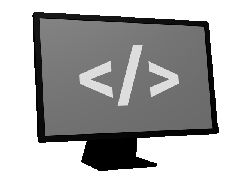

# Topframe
Local webpage screen overlay

<!-- <a href="https://goreportcard.com/report/github.com/progrium/topframe" title="Go Report Card"></a> -->
<a href="https://twitter.com/progriumHQ" title="@progriumHQ on Twitter"></a>
<a href="https://github.com/progrium/topframe/discussions" title="Project Forum"></a>
<a href="https://github.com/sponsors/progrium" title="Sponsor Project"></a>

---


* Customize your computing experience with webdev
* Display information and always-on-top widgets
* Edit source, hit save, screen will update
* Extensible with shell scripts in any language
* Less than 400 lines of Go code, minimal deps
* Currently alpha, macOS only ...

## Getting Started

You can download from [Releases](https://github.com/progrium/topframe/releases) or with Homebrew you can:

```
$ brew install progrium/taps/topframe
```

If you download a release zip make sure to unzip and put the binary in your PATH (like /usr/local/bin). 

```
$ topframe -h
Usage: topframe <flags>
Topframe is a fullscreen webview overlay agent

Flags:
  -docs       open documentation in browser
  -help       show help
  -plist      generate launch agent plist
  -version    show version
```

To start it and show the demo webpage overlay, simply run `topframe`. This will also:

* create a `~/.topframe` directory with a demo `index.html` used for the overlay
* watch for file changes in `~/.topframe` to trigger a page reload
* add a menu bar extra (🔲) to control the overlay

If you edit `~/.topframe/index.html` and hit save, changes will reflect immediately. If you hate the demo content of the default `index.html`, change it! Use **Show Source** from the menu extra to quickly
open your topframe directory.

### Launching on Startup

Topframe works with `launchd` to run as a background agent on startup. You can generate
an agent plist file with `topframe -plist`, which you can write to a file in `~/Library/LaunchAgents`:

```
$ topframe -plist > ~/Library/LaunchAgents/com.progrium.Topframe.plist
```

It's a good idea to view the output before writing to the file, just to make sure
paths are correct. If you don't know what is correct, it's probably fine!


## Documentation

There is not a whole lot to Topframe! I recommend [reading the source](https://github.com/progrium/topframe/blob/main/topframe.go) as its only a few hundred lines,
but otherwise there is a [wiki](https://github.com/progrium/topframe/wiki) ready to document anything else.

## Getting Help

If you're having trouble, be sure to check [issues](https://github.com/progrium/topframe/issues) to see if its a known issue. Otherwise, feel free to drop
a question into the [discussion forum](https://github.com/progrium/topframe/discussions).

## Contributing

Ideally, Topframe is kept small. Bug fixes and other small PRs are welcome and should be merged quickly.
If you happen to have a large PR that we haven't discussed, you should talk about it in the forum first. In order
to keep the project small, some features suggestions may be held back in favor of determining a good extension point to expose instead.

## About

Topframe started as a 130 line example for [progrium/macdriver](https://github.com/progrium/macdriver).

MIT Licensed